# 围绕外框旋转
## 效果 
 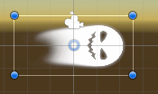------>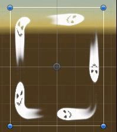

## 实现   
核心是把uv改成：uv = 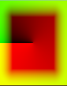    u = 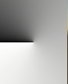  v = 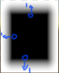    
下面是实现步骤    
******   
首先把uv-0.5,原点移动到中心来
```
i.uv -=0.5;   
```
*******

### u部分:   
用atan2来获取角度：
```
float radians = atan2(i.uv.y,i.uv.x);
float pi = 3.1415926;
float degress =radians/pi;
return half4(degress,degress,degress,1);
```
这一段先看输出结果：
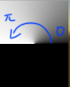   
得到 x正方向，逆时针，0->pi

加上abs看下面黑色的实际范围：
```
float radians = atan2(i.uv.y,i.uv.x);
float pi = 3.1415926;
float degress =radians/pi;

// 加上这一句 看下半部分的范围
degress = abs(degress);

return half4(degress,degress,degress,1);

```
可以看出范围：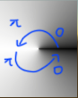   
因为图上展示的是取了绝对值的，没取绝对值的实际值是，从x负方向，逆时针 -pi->0    
   

加上一个周期再除以2pi得到从0到1的范围：
```
float radians = atan2(i.uv.y,i.uv.x);
float pi = 3.1415926;

//改成一个2pi的周期，得到从0->1的变化
float degress = (radians+pi)/(2*pi);              
return half4(degress,degress,degress,1);
```
最终可以获得从0到1的范围：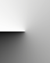   

然后加上参数.z作为速度变化参数，转起来：
```
``
//用1-degress变成顺时针
half u = frac(1- degress -_Time.x*_Parameters.z*0) ; 
return half4(u,u,u,1);
```
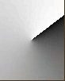

------------------   
### v部分比较简单:   
先取绝对值,然后x和y同时减去一个值,再限制0到1,取长度,挖空中间
```
half2 absUV =abs(i.uv);
float2 absUVSubstract = absUV-_Parameters.x;  
float2 afterSaturate = saturate(absUVSubstract); 
float v = length(afterSaturate);
return half4(v,v,v,1);
```
得到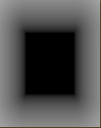  

把边界的地方变成1:
```
//变换到{0，1}
half d = 0.5-_Parameters.x; 
v = smoothstep(0,d,v);
```
变换到{0，1}
***
最后用得到的uv正常采样图片:
```
half2 uv = half2(u,v);
half4 col = SAMPLE_TEXTURE2D(_MainTex, sampler_MainTex, uv) * i.color; 
```
采样得到结果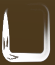   

在u部分稍微变化一下,可以分段:
```
float degress = (radians+pi)/(2*pi) * _Parameters.y;
```
分段结果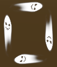

稍微改下参数:
